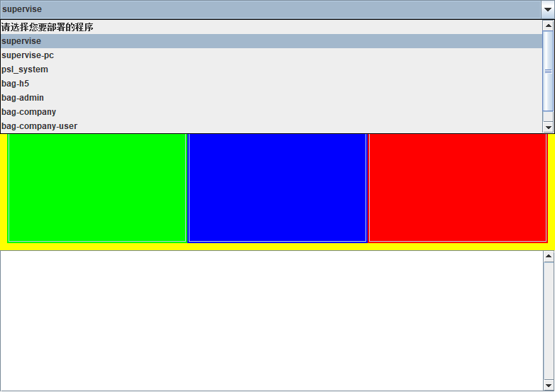
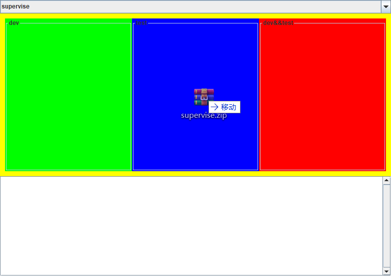
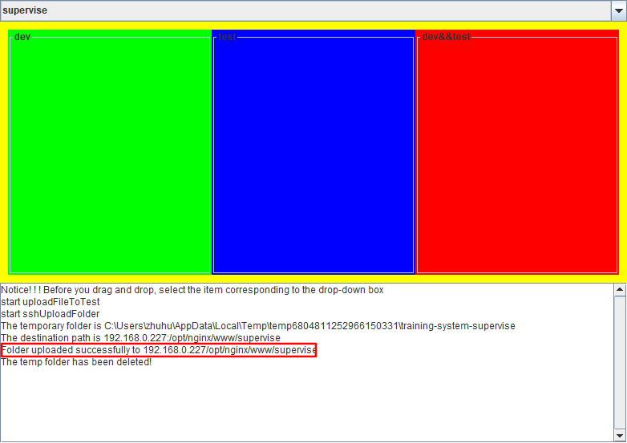

# FileUploader

这是一个前端包文件上传工具

#### 使用说明

首先在下拉框选中要部署的项目

 

然后将要部署的包拖放在要部署的环境中。dev对应开发环境。test对应测试环境。dev&&test对应开发和测试一起部署。目前支持的文件格式是zip和rar。

> 拖拽后请等待一段时间

部署成功会显示successfully字样，反之就是没有部署成功。

#### 特点

- 省去了打开压缩包寻找dist目录和登录对应服务器的过程

- 支持dev test一起部署

  

